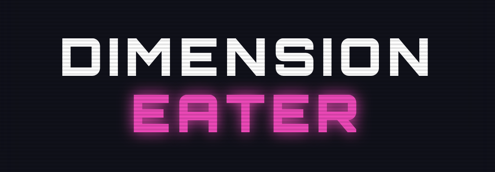

# Dimension Eater



## Overview

Dimension Eater is a high-fidelity, futuristic side-scrolling action puzzle game built with Pixi.js, TypeScript, and Vite. Players control a glowing temporal chain across parallel timeline layers to avert causal cascades and stabilize a collapsing space-time continuum. The experience merges classic snake movement mechanics with complex dimensional jumping, featuring real-time isometric 3D projections, dynamic difficulty scaling, and a responsive cyber-neon visual system.

## Core Mechanics

The primary objective centers around temporal stabilization and upstream causal intervention. The timeline moves constantly to the left, representing the progression of time. Players navigate their temporal chain through the space-time grid, pushing forward to increase horizon reach or dodging backwards to align with defensive positions. Eating floating Time Essences increases the chronological length of the chain.

As the temporal chain grows, parallel Z-axis timeline layers unlock dynamically. Unlocking follows a perfect square curve starting at length four. When anomalies spawn on upper parallel dimensions, they trigger causal cascades that send lethal obstacles onto the base timeline. Players must actively jump to these upper dimensions, track the anomaly spawners, and destroy them at the horizon before they cause timeline collapse.

Collisions with obstacles or lasers trigger an automatic chronological rewind. The system retracts the chain length by twenty percent to mend the paradox and safe-spawns the player back in historical coordinates. Falling below a minimal length of three terminates the timeline, resulting in a collapse and ending the game.

To enhance the cybernetic atmosphere, a dynamic particle engine generates chronal spark trails. Energy particles continuously emit from the head and body segments of the chain, floating backward and decaying with premium physical simulation across the isometric grid.

## Two Player Versus Mode

The game includes a local competitive mode where two players navigate the same stacked timeline layers simultaneously. Player One guides a cyan-themed temporal chain, while Player Two controls a magenta-themed chain. Each player operates with an independent chronological lifeline. If one player collides with a hazard, they undergo a localized timeline rewind while the other player continues to move and accumulate score.

Crossover rules prevent players from easily obstructing each other. Ramming a player's head into another chain's body or crashing head-to-head triggers instant rewinds for the instigator. When a player collapses completely or achieves ultimate timeline stabilization, a detailed versus results screen presents the crowned victor along with side-by-side telemetry comparisons.

## Controls

Control inputs are mapped ergonomically to accommodate local couch play on a single keyboard. Player One coordinates spatial movement using the `W`, `A`, `S`, and `D` keys, and shifts between `Z`-dimensions using the `Q` and `E` keys. Player Two navigates the grid using the `Arrow` keys and jumps parallel timeline layers using the `Comma` and `Period` keys.

## Development and Deployment

The project is built on modern web technologies, utilizing TypeScript compilation, ESLint flat configuration, and Vite asset bundling.

To initiate the local development server, run the following command in your terminal:

```bash
pnpm run dev
```

This boots up the Vite environment, typically hosted on localhost. To package the project for publication on platforms like itch.io, execute the following command:

```bash
pnpm run build:zip
```

This automatically compiles the source code, bundles assets under the `dist` directory, and packages the contents into a `game.zip` archive at the root of the project with `index.html` positioned at the top level for immediate browser loading.

## Pnpm Command Reference

The development workflow is supported by a comprehensive suite of package commands. To run the local development server, execute:

```bash
pnpm run dev
```

For producing optimized static assets, trigger the following command:

```bash
pnpm run build
```

This compiles the TypeScript code and bundles assets into the `dist` folder. To preview this compiled production build locally, run:

```bash
pnpm run preview
```

Code quality and formatting guidelines are enforced through static analysis, which can be executed by running:

```bash
pnpm run lint
```

To automatically fix resolvable code style and formatting issues, run:

```bash
pnpm run lint:fix
```

Finally, when you are ready to prepare the game for itch.io distribution, execute the following command:

```bash
pnpm run build:zip
```

This bundles and compresses the production files into a single, upload-ready zip archive located at the root of the workspace.
